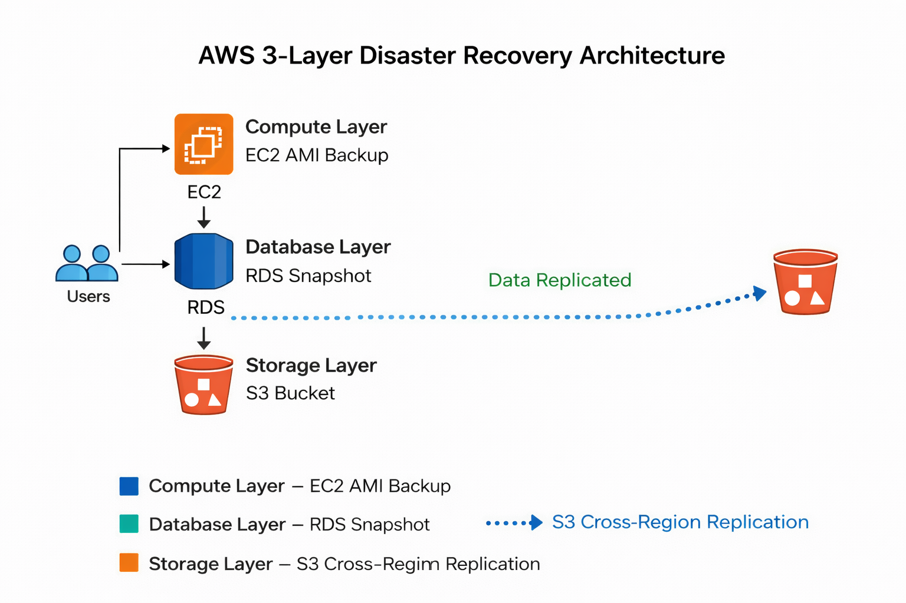

# 🚀 AWS 3-Layer Disaster Recovery Project

## 📌 Project Overview

This project demonstrates a complete Disaster Recovery (DR) architecture on AWS using a 3-layer backup strategy:

- Compute Layer → EC2 AMI Backup  
- Database Layer → RDS Snapshot  
- Storage Layer → S3 Cross-Region Replication  

---
## 🏗 Architecture Design

## 🏗 Architecture Design

---

## 🟢 Phase 1: EC2 Disaster Recovery

### Steps Performed:
1. Launched EC2 instance
2. Configured application
3. Created AMI backup
4. Launched new instance from AMI for testing

### Result:
✔ Compute layer backup successful  
✔ Instance can be restored anytime  

---

## 🟢 Phase 2: RDS Disaster Recovery

### Steps Performed:
1. Created MySQL RDS instance
2. Enabled automated backups
3. Created manual snapshot
4. Restored database from snapshot

### Result:
✔ Database recovery verified  

---

## 🟢 Phase 3: S3 Cross-Region Replication

### Steps Performed:
1. Created S3 bucket in Mumbai
2. Enabled versioning
3. Created S3 bucket in Singapore
4. Configured replication rule
5. Verified automatic file replication

### Result:
✔ Storage replicated across regions  
✔ Data available even if primary region fails  

---

## 💡 Key Learnings

- Multi-layer AWS Disaster Recovery strategy
- IAM role configuration for replication
- Snapshot-based database recovery
- Cross-region DR planning

---

## 🛠 Technologies Used

- Amazon EC2
- Amazon RDS
- Amazon S3
- AWS IAM
- AWS VPC

---

## 👨‍💻 Author

Shivam Kumar  
MCA | Cloud & DevOps Enthusiast
